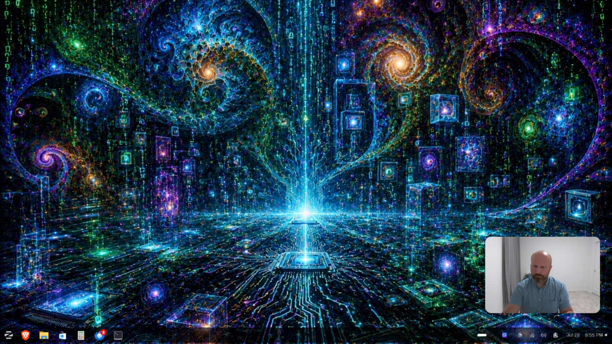
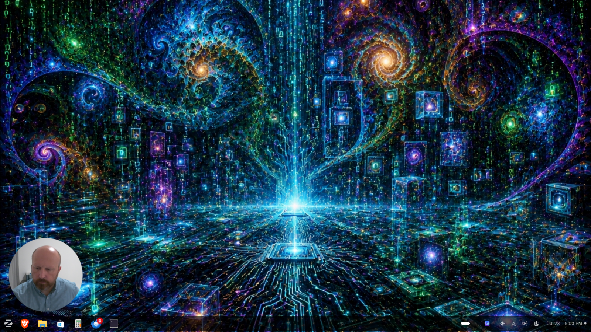
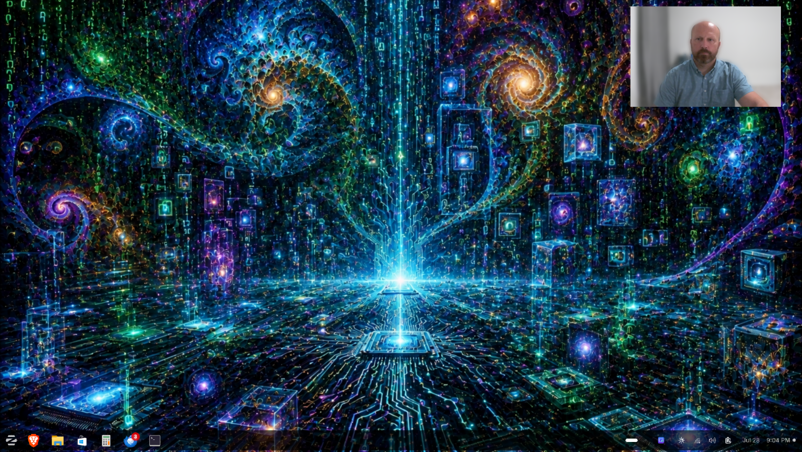

# PeekCam

A movable, always-on-top **webcam overlay** for Zorin/Ubuntu. Floats your camera in a
corner of the screen, drag/resize it anywhere, shape it (rectangle / rounded / circle),
tune every camera setting the device exposes, snapshot, record, and pass clicks through
to the window underneath — ideal for screen recording and streaming.



Drag it to any corner and shape it — rectangle, rounded, or circle:

<p>
  
  
</p>

## Why it runs under XWayland

GNOME's Wayland compositor (Mutter) doesn't let normal apps pin themselves always-on-top
or position/resize themselves freely, and it doesn't support `wlr-layer-shell`. So
PeekCam runs as an **X11 client under XWayland** (`QT_QPA_PLATFORM=xcb`, set by
`run.sh`), where those capabilities work reliably. No system changes required.

## Install

```bash
./install.sh          # installs deps (sudo) + an application-menu entry
```

Dependencies: `python3-pyqt6`, `python3-gi`, GStreamer plugins (good/bad/libav), and
`v4l-utils`. GStreamer's `v4l2src`, `jpegdec`, and `x264enc` are used for capture and
recording.

## Run

- From the **applications menu**: “PeekCam”.
- Or directly: `./run.sh`

Right-click the overlay (or use the tray icon) for Settings, Shape, Mirror,
Click-through, Snapshot, Record, and Quit. `Ctrl + mouse-wheel` over the overlay adjusts
opacity. Drag the bottom-right corner to resize; drag anywhere else to move.

## Settings

Settings → **Source & format** picks the camera, pixel format (MJPG preferred for higher
res/fps), resolution, and frame rate. **Camera controls** are generated dynamically from
whatever the selected camera reports via `v4l2-ctl` (brightness, contrast, gain,
white-balance, exposure, focus, zoom, powerline frequency, …). Values are saved per
camera and restored on next launch.

## Background blur (optional)

Blurs the background while keeping you sharp, like video-call apps. It uses MediaPipe
selfie segmentation, which must run in a **separate process** (its EGL/GL + X context
conflicts with Qt/XWayland in-process), exchanging frames via shared memory.

One-time setup (needs sudo for the venv/pip prerequisites):

```bash
sudo apt install -y python3.12-venv python3-pip
./setup_blur.sh      # creates .venv (with system PyQt6/GStreamer), installs mediapipe,
                     # and downloads the selfie-segmenter model into models/
```

`run.sh` auto-uses `.venv` when present. Toggle blur from the right-click / tray menu or
`./run.sh --toggle-blur`. If the stack isn't installed, the toggle just reports it's
unavailable and everything else keeps working.

Notes: runs ~24 fps at 720p (segmentation on a downscaled copy, SIMD composite); heavier
at 4K, so 720p is a good choice for the overlay. Blur applies to **everything you see** —
the overlay, snapshots, and recordings (recording is fed the same displayed frames via
`appsrc`, so it captures exactly what's on screen).

## Global hotkeys (Wayland-correct)

Real global key-grabs are blocked on Wayland, so PeekCam runs as a **single instance**
and accepts action flags that it forwards to the running instance:

```bash
./run.sh --snapshot
./run.sh --toggle-record
./run.sh --toggle-clickthrough
./run.sh --cycle-camera
./run.sh --toggle-blur
./run.sh --show-hide
./run.sh --quit
```

Bind these to keys in **Settings → Keyboard → View and Customize Shortcuts → Custom
Shortcuts**. Example: Name “Overlay snapshot”, Command `/home/sebastian/peekcam/run.sh --snapshot`,
then assign a shortcut.

## Files saved

- Snapshots → `~/Pictures/peekcam-<timestamp>.png`
- Recordings → `~/Videos/peekcam-<timestamp>.mp4`
- Config → `~/.config/peekcam/config.json`

## Layout

| File | Purpose |
|------|---------|
| `peekcam/main.py` | entry point, controller, tray, CLI action forwarding |
| `peekcam/overlay_window.py` | frameless always-on-top window; drag/resize/shape/click-through |
| `peekcam/pipeline.py` | GStreamer capture (appsink) + appsrc encoder for recording |
| `peekcam/device_manager.py` | camera + format discovery (`v4l2-ctl`) |
| `peekcam/v4l2_controls.py` | dynamic control discovery/apply |
| `peekcam/settings_dialog.py` | source/format + generated control widgets |
| `peekcam/recorder.py` | snapshot/recording paths + snapshot save |
| `peekcam/blur.py` | background-blur client (drives the worker over shared memory) |
| `peekcam/blur_worker.py` | isolated subprocess: MediaPipe segmentation + composite |
| `peekcam/ipc.py` | single-instance socket + action forwarding |
| `peekcam/config.py` | JSON persistence |

## Development

```bash
git clone https://github.com/sebszwolin777/peekcam
cd peekcam
./install.sh          # system deps + menu entry
./setup_blur.sh       # optional: background-blur ML stack
./run.sh              # launch
```

## Status

Beta. Built and tested on Zorin OS 18 (Ubuntu 24.04) / GNOME Wayland. It should work on
other GNOME/Wayland and X11 setups but hasn't been widely tested. Issues and PRs welcome.

## License

GPL-3.0-or-later — see [LICENSE](LICENSE). (PeekCam uses PyQt6, which is GPLv3; a
permissive relicense would require switching the UI to PySide6/LGPL.) MediaPipe is
Apache-2.0; the selfie-segmentation model is downloaded at setup time and is **not**
redistributed here.
